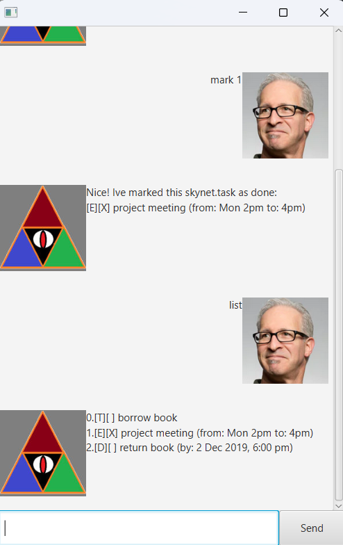

# Skynet User Guide

Amazing skynet chatbot to meet all your scheduling needs.

## Adding deadlines

Add deadlines using the deadline command.

Format: `deadline {task_name} /by {timing}`

Example: `deadline meeting /by 2/12/24`

skynet adds your deadline to the list of existing tasks.

## Adding ToDo tasks

Add todos using the todo command.

Format: `todo {task_name}`

Example:
`todo meeting`

skynet adds your todo to the list of existing tasks.

## Adding event tasks

Add events using the event command.

Format: `event {task_name} /from {timing} /to {timing}`

Example:
`event meeting /from 2 /to 4`

skynet adds your event to the list of existing tasks.

## List all tasks

List out all current tasks

Format: `list`

## Delete an task 

Delete the specified task

Format: `delete {task_name}`

## Exit the program

Exits the program

Format: `exit`

## Saving the data
Skynet automatically saves all tasks locally after any command.

